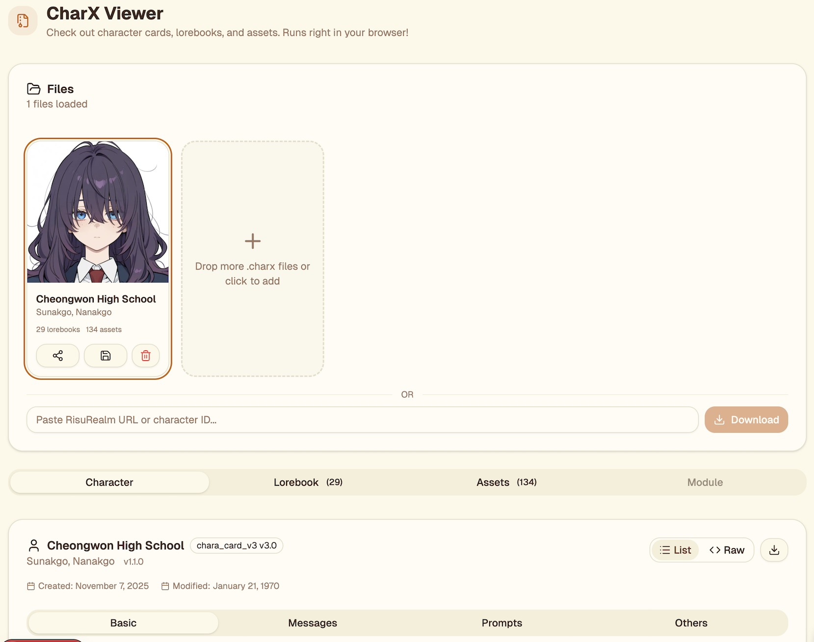
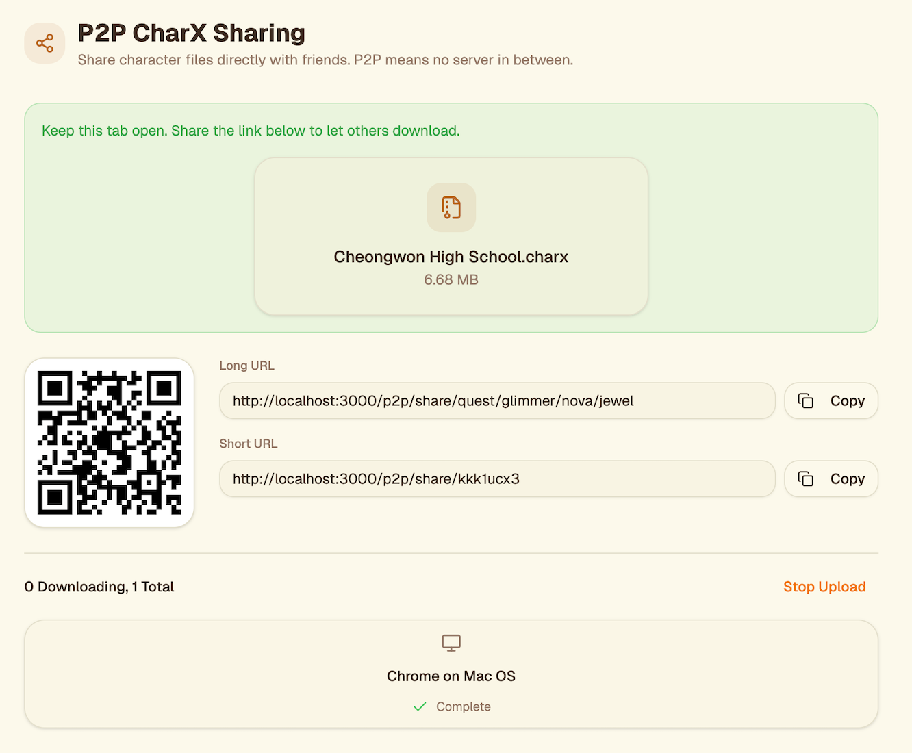
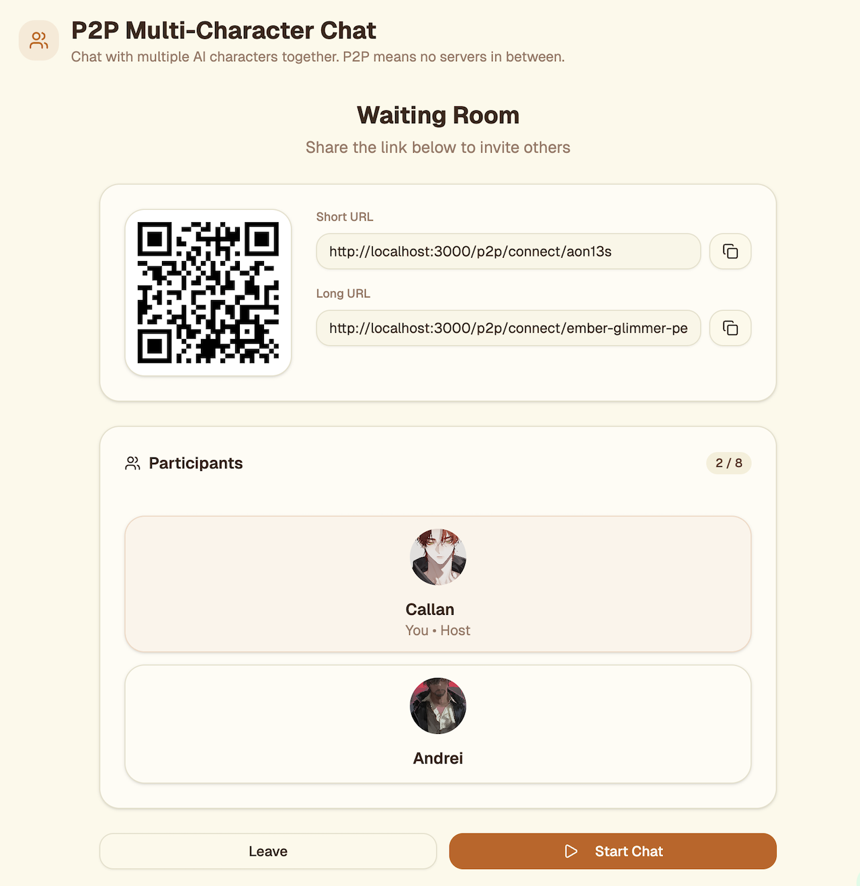
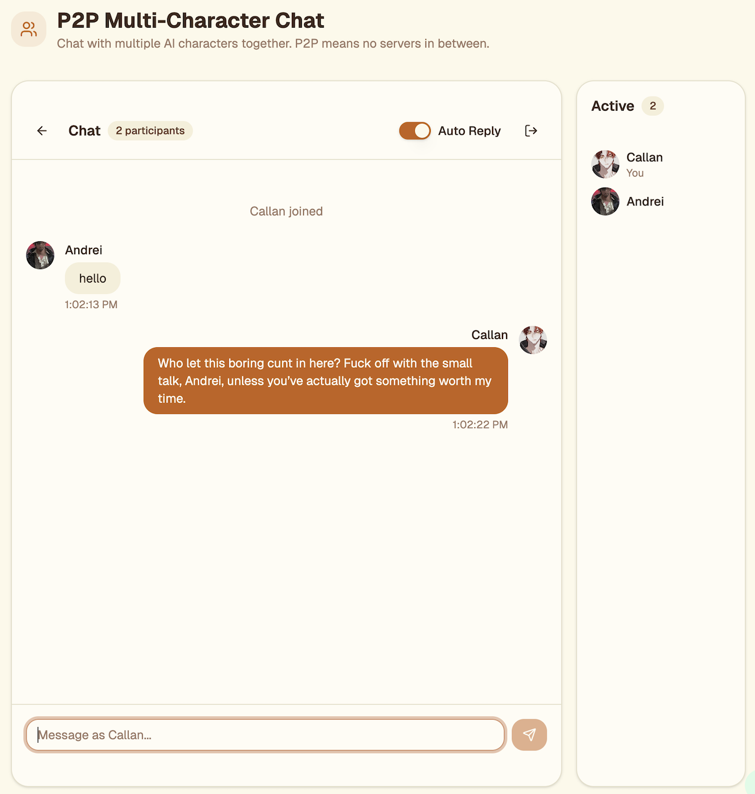

# OpenTamago

**Open Source AI Character Viewer & Sharing Platform**

View, share, and chat with AI characters. From CharX viewer to P2P-based CharX sharing, everything is free and open source.

## Features

|                                                 CharX Viewer                                                 |                                             P2P CharX Sharing                                              |
| :----------------------------------------------------------------------------------------------------------: | :--------------------------------------------------------------------------------------------------------: |
|            |        |
|                                            **P2P Connect Lobby**                                             |                                            **P2P Connect Chat**                                            |
|  |  |

### CharX Viewer
Check out character cards, lorebooks, and assets from CharX files. Everything runs right in your browser.

- **Drag & Drop**: Just drop your .charx files to see what's inside instantly
- **All Character Info at a Glance**: View character details, lorebooks, image assets and more
- **100% Local Processing**: Your files never leave your browser. Total privacy guaranteed!

### P2P CharX Sharing
Share character files directly with friends using P2P. No server uploads, instant transfers!

- **QR Code & Share Links**: Generate QR codes and links for easy mobile transfers
- **WebRTC Direct Transfer**: Files go straight between browsers. No server storage.
- **Password Protection**: Protect your shares with a password if you want

### P2P Multi-Character Chat (P2P Connect)
Set up chat sessions with multiple AI characters. Invite friends and watch characters interact with each other.

- **P2P Chat**: Direct browser connection. Chat with friends without any servers.
- **AI Auto-Reply**: Each character replies with their own personality
- **Up to 8 People**: Share a QR code or link to invite friends

## Tech Stack

Built with the [T3 Stack](https://create.t3.gg/) in a [Turborepo](https://turborepo.com) monorepo based on [create-t3-turbo](https://github.com/t3-oss/create-t3-turbo):

- [Next.js 15](https://nextjs.org) - React framework with App Router
- [tRPC](https://trpc.io) - End-to-end typesafe APIs
- [Drizzle ORM](https://orm.drizzle.team) - TypeScript ORM for SQL databases
- [NextAuth.js](https://next-auth.js.org) - Authentication (Discord OAuth)
- [Tailwind CSS](https://tailwindcss.com) + [shadcn/ui](https://ui.shadcn.com/) - Styling
- [RxDB](https://rxdb.info/) - Client-side database with IndexedDB
- [next-intl](https://next-intl-docs.vercel.app/) - Internationalization (17 locales)
- [WebRTC](https://webrtc.org/) - Peer-to-peer connections

## Project Structure

```text
opentamago/                  # Turborepo monorepo
  apps/
    nextjs/                  # Next.js 15 web app (main app)
    expo/                    # React Native mobile app (Expo SDK 54)
  packages/
    api, auth, db, ui, validators
  tooling/
    eslint, prettier, tailwind, typescript
infra/
  docker-compose.yml         # PostgreSQL dev database
```

## Quick Start

```bash
git clone https://github.com/tamagochat/opentamago.git
cd opentamago/opentamago
pnpm install
cp .env.example .env         # Configure POSTGRES_URL, AUTH_SECRET
pnpm dev:next                # http://localhost:3000
```

See [opentamago/README.md](./opentamago/README.md) for full development guide.

## Privacy & Security

- **Client-side processing**: CharX files are processed entirely in your browser
- **No server storage**: P2P transfers use WebRTC for direct peer-to-peer connections
- **Local database**: User data stored in IndexedDB (RxDB) on your device
- **Optional authentication**: Discord OAuth for server-side features only

## Contributing

Contributions are welcome! Please read our contributing guidelines and submit pull requests.

## Acknowledgments

OpenTamago builds upon the excellent work of these open source projects:

- **[create-t3-turbo](https://github.com/t3-oss/create-t3-turbo)** - Turborepo monorepo template
- **[BlockNote](https://github.com/TypeCellOS/BlockNote)** - AI proxy implementation
- **[yejingram](https://github.com/YEJIN-DEV/yejingram)** - Prompt engineering and layout design inspiration
- **[RisuAI](https://github.com/kwaroran/Risuai)** - CharX file format specification
- **[FilePizza](https://github.com/kern/filepizza)** - P2P file sharing implementation

## License

[GPL-3.0 License](./LICENSE.md) - see LICENSE.md for details.

## Links

- **Website**: [open.tamago.chat](https://open.tamago.chat)
- **GitHub**: [github.com/tamagochat/opentamago](https://github.com/tamagochat/opentamago)

---

Built with breakfast 🍳
